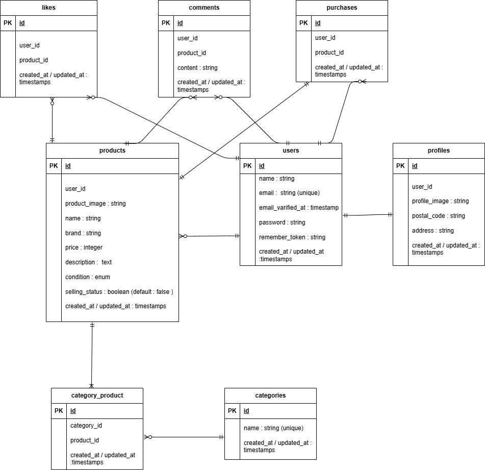

# アプリケーション名

### coachtech フリマ

## 環境構築

#### 1. Docker ビルド

```bash
git clone リンク
docker-compose up -d --build
```

\*MySQL は、OS によって起動しない場合があるのでそれぞれの PC に合わせて docker-compsoe.yml ファイルを編集してください。

#### 2. Laravel 環境構築

・composer のインストール

```bash
docker-compose exec php bash
composer install
```

#### 3. .env.example をコピーし.env ファイルを作成、環境変数の変更。

\*メールの設定について以下を参考にしてください

```.env
MAIL_MAILER=smtp
MAIL_HOST=mailhog
MAIL_PORT=1025
MAIL_USERNAME=null
MAIL_PASSWORD=null
MAIL_ENCRYPTION=null
MAIL_FROM_ADDRESS="test@example.com"
MAIL_FROM_NAME="CoachtechFleamarket"
```
*データベースの設定について以下を設定してください
```
DB_CONNECTION=mysql
DB_HOST=mysql
DB_PORT=3306
DB_DATABASE=laravel_db
DB_USERNAME=root
DB_PASSWORD=root
```

*決済機能Stripeの設定について以下を設定してください
```
STRIPE_KEY=あなたのStripeパブリッシュ可能キー
STRIPE_SECRET=あなたのStripeシークレットキー
```

#### 4. アプリケーションキーの設定

```bash
php artisan key:generate

```

#### 5. マイグレーション、シーディングの実行

```bash
php artisan migrate
php artisan db:seed

```

#### 6. シンボリックリンクの実行

```bash
php artisan storage:link
```

"The stream or file could not be opened"エラーが発生した場合
src ディレクトリにある storage ディレクトリに権限を設定

```
chmod -R 777 storage
```

#### 7. テスト環境の構築・実行 PHPUnit
##### 本プロジェクトには Laravel の Feature / Unit テストが用意されています。  

- テスト用DBの作成<br>
⇒mysqlコンテナに管理者としてログインしてテスト用DBの作成
```
CREATE DATABASE laravel_test_db;
```
- テスト用.envファイル作成
```bash
cp .env .env.testing
```
- .env.testingファイルの環境変数の変更<br>
<設定項目><br>
```
APP_ENV=testing
APP_KEY=
DB_CONNECTION=mysql_test
DB_DATABASE=laravel_test_db
DB_USERNAME=root
DB_PASSWORD=root
```

- テスト用アプリケーションキーの作成
```bash
php artisan key:generate --env=testing
```
- マイグレーション実行
```bash
php artisan migrate --env=testing
```
- テストの実行
```bash
php artisan test
```
#### 8. テスト環境の構築・実行 Laravel Dusk
##### 本プロジェクトには Laravel の Laravel Dusk テストが用意されています。  

- テスト用DBの作成<br>
⇒mysqlコンテナに管理者としてログインしてテスト用DBの作成
```
CREATE DATABASE laravel_dusk_db;
```
- テスト用.envファイル作成
```bash
cp .env .env.dusk.local
```
- .env.testingファイルの環境変数の変更<br>
<設定項目><br>
```
APP_ENV=dusk
APP_KEY=
DB_CONNECTION=mysql_test
DB_DATABASE=laravel_dusk_db
DB_USERNAME=root
DB_PASSWORD=root
```

- テスト用アプリケーションキーの作成
```bash
php artisan key:generate --env=dusk.local
```
- マイグレーション実行
```bash
php artisan migrate --env=dusk.local
```

- テストの実行
```bash
php artisan dusk
```

#### 手動でテストを実行する際のログイン情報
##### 以下のメールアドレスとパスワードでダミー商品に出品車として紐づいたユーザにログインできます
- ユーザ１<br>
id : 1<br>
name : user1<br>
email : user1@example.com<br>
password : coachtech<br>

- ユーザ２<br>
id : 2<br>
name : user2<br>
email : user2@example.com<br>
password : coachtech<br>

#### Stripe連携について

このアプリでは決済機能にStripeを使用しています。<br>

#### テスト環境での使用について

Stripeの開発用アカウントが必要です（https://dashboard.stripe.com/register
 にて無料で作成可能）。<br>

・Stripeのテスト用クレジットカードを使用して決済を試すことができます：

+ 番号：4242 4242 4242 4242

+ 有効期限：任意の未来日付（例：12/34）

+ CVC：任意（例：123）

##### ※注意事項

本番用の決済には切り替えないでください（テストモードのままで使用してください）。<br>

本番環境での利用を想定する場合は、Stripeアカウントを「本番モード」に切り替え、商業情報の登録等が必要になります。<br>

本プログラムのメール認証にはMailHogを使用しています。<br>
現在認証メールが登録後に自動送信されない現象が起きています。<br>
届いていない場合は"認証メールを再送する"をクリックして再送してください。<br>

## 使用技術

フレームワーク：Laravel 8.7<br>
言語：PHP 7.4<br>
データベース：MySQL 8.0<br>
Web サーバー：Nginx 1.21.1<br>
管理ツール：phpMyAdmin<br>
仮想メールツール : mailhog<br>
決済サービス：Stripe（テストモード利用）<br>
実行環境：Docker（docker-compose v3.8）<br>

## ER 図



## URL

- phpMyAdmin : http://localhost:8080/
- mailhog Web_UI : http://localhost:8025/
- 商品一覧画面（トップページ）: http://localhost/
- 会員登録画面 : http://localhost/register
- ログイン画面 : http://localhost/login
- マイページ（プロフィール） : http://localhost/profile
- 商品出品画面 : http://localhost/items/sell
